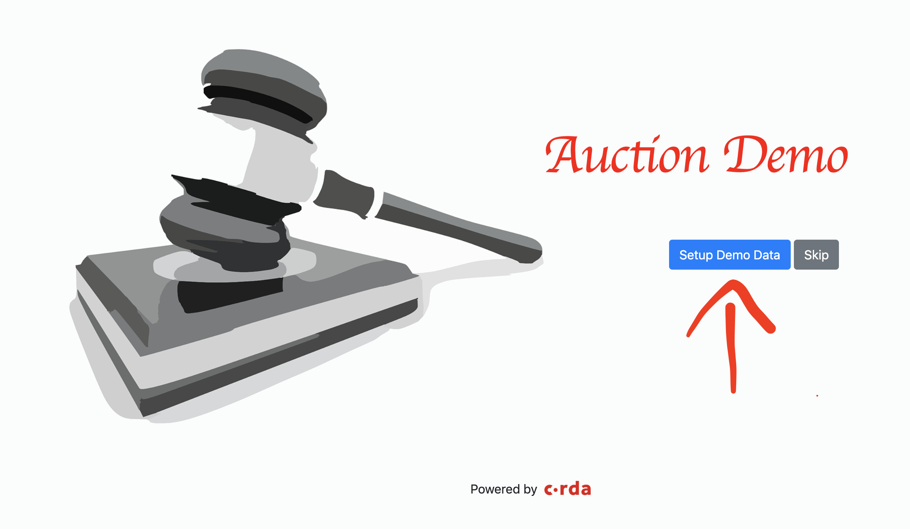

# Auction CorDapp

This CorDapp serves as a demo of building an auction application on Corda. It leverages
different features of Corda like `SchedulableState`, `StatePointer` and `OwnableState`. It also demonstrate 
how to perform a DvP (Delivery vs Payment) transaction on Corda.

It has a full-functional client included and an angular UI to interact with the nodes.

## Pre-requisites:
See https://docs.corda.net/getting-set-up.html.

## Running the nodes:
 
See https://docs.corda.net/tutorial-cordapp.html#running-the-example-cordapp.

## Running the client:

The client can be run by executing the below command from the project root:

`./gradlew runAuctionClient`

Please make sure that the nodes are already running before starting the client. 
The client can be accessed at http://localhost:8085/

## Usage

1. Click on the "Setup Demo Data" button to create somde demo data to play with or you
may use the skip button if you wish to setup the deata yourself.

2. 